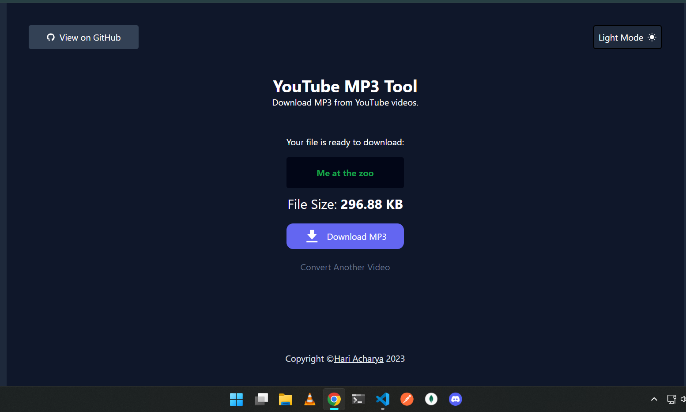

# YouTube MP3 Downloader

Complete React.js Single component website to download music file (mp3) from any youtube video.

<strong>Live Demo: <a href="https://ytmp3.hari-acharya.com.np">ytmp3.hari-acharya.com.np</a></strong>

Some special features of this react application is: 
-Single Function Component responsible for handeling full rendering/fetching logic. 
-Download MP3 Version of any YouTube video with just the link. 
-Dark / Light mode. 
-See file size before downloading. 
-Deploy locally, in a server or pack as a electron application. 
-Select Quality of audio to download (Coming Soon, planned). 

<italic>Please feel free to open a PR or Issue. It's personal project and is PR friendly.</italic>

To start the project locally, you don't need to do much. Just clone the repo and make necessary changes as you wish. One thing to notice is that the backend will require a seperate API key which you can get at <a href="https://rapidapi.com/420vijay47/api/youtube-mp3-downloader2/">RapidAPI</a>

There are no other enviroment varibles to change. It's easy clone & deploy without headache.
